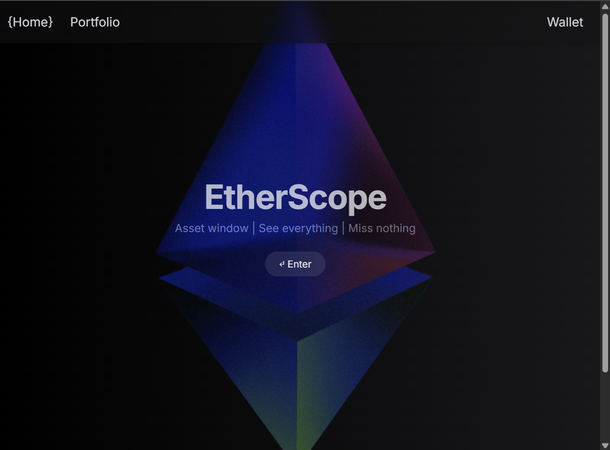
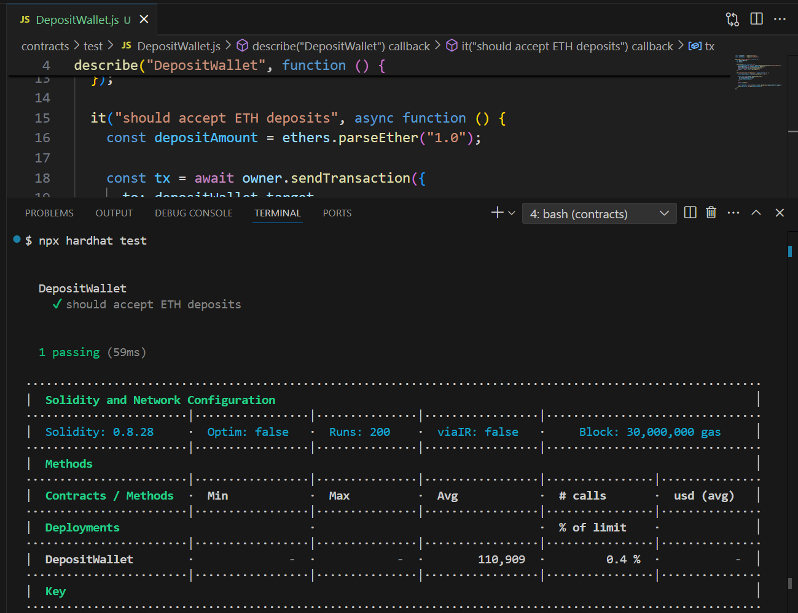

# EtherScope

**A full-stack Web3 wallet portfolio dashboard for Ethereum (Sepolia testnet).**

EtherScope lets you connect your wallet, view your ETH balance, recent transactions, and on-chain deposits using modern dApp tools.  
Built with Solidity, Node.js (Express), React, and Tailwind CSS.

---

## Features

- **Connect MetaMask** or WalletConnect (RainbowKit + Wagmi)
- Fetch and display wallet ETH balance from Sepolia testnet
- View recent transaction history (via Etherscan API)
- Track deposit events (if using custom DepositWallet contract)
- Clean, modern UI with responsive dark theme
- Quick start: runs locally, easily deployable (Vercel + Render)
- No mainnet support — **Sepolia testnet only**

---

## Tech Stack

| Layer           | Tools / Technologies                                   |
| --------------- | ------------------------------------------------------ |
| Smart Contracts | Solidity, Hardhat (optional: local dev blockchain)     |
| Backend API     | Node.js, Express, Ethers.js, Alchemy, Etherscan API    |
| Frontend        | React, Vite, Tailwind CSS, Wagmi, RainbowKit           |

---

## How to Use

### 1. **Clone the Repo**

```bash
git clone https://github.com/YourUsername/etherscope.git
cd etherscope
```

### 2. **Setup Environment Variables**

- Duplicate `.env.example` → `.env` in both `/backend` and `/frontend` folders.
- Set your Alchemy Sepolia API key and (optional) Etherscan Sepolia API key.

Example `.env` for backend:

```
ALCHEMY_API_KEY=your-sepolia-alchemy-key
ETHERSCAN_API_KEY=your-sepolia-etherscan-key
```

> **Note:** Only Sepolia testnet is supported.  
To get Sepolia test ETH for testing:

1. Visit the [Alchemy Sepolia Faucet](https://alchemy.com/faucets/ethereum-sepolia).
2. Paste your wallet address.
3. Complete the captcha and click **"Send Me ETH"**.
4. Wait a few seconds—your Sepolia ETH will appear in your wallet!

### 3. **Install Dependencies**

Backend:
```bash
cd backend
npm install
```

Frontend:
```bash
cd ../frontend
npm install
```

### 4. **Start the Backend**

```bash
cd backend
node server.js
```

The backend API will run at `http://localhost:4000`.

### 5. **Start the Frontend**

```bash
cd ../frontend
npm run dev
```

The frontend will run at `http://localhost:5173` (or as specified by Vite).

---

## API Endpoints

- `/api/portfolio/:address` → ETH balance via Alchemy Sepolia
- `/api/transactions/:address` → Transaction history (Sepolia Etherscan)
- `/api/deposits/:address` → Deposit events from DepositWallet contract (if deployed)

---

## Screenshots

### Main Dashboard


### Smart Contract Test Screenshot


---

## Author

Created and maintained by [Cyberbot777](https://github.com/Cyberbot777).

---

### Notes

- Backend runs from `/backend`, frontend from `/frontend`.
- You can deploy the frontend (Vercel recommended) and backend (Render or similar).
- Only Sepolia testnet supported in this release.

---
